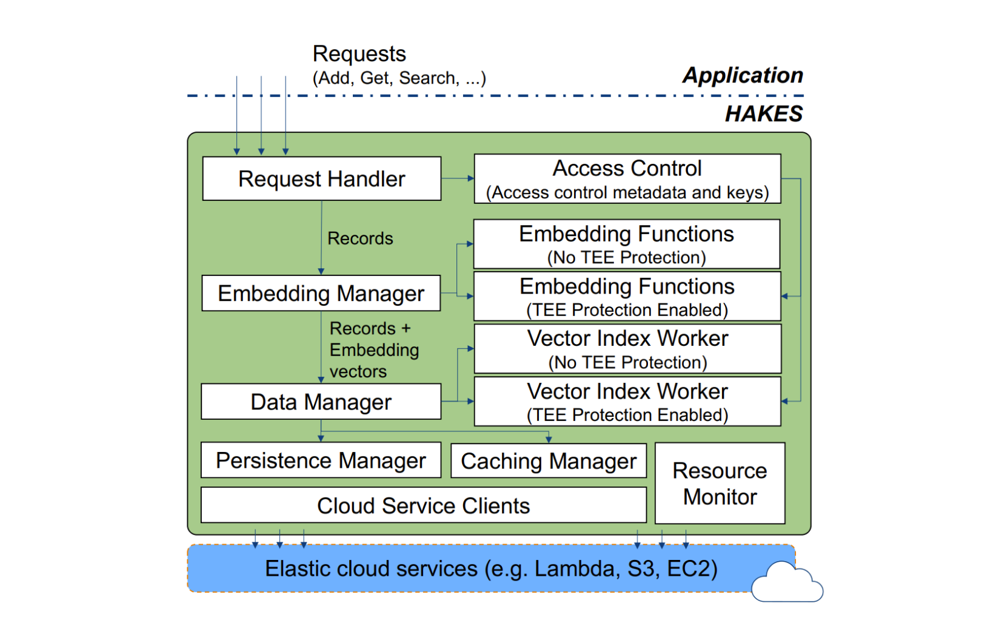

# HAKES

HAKES is an embedding vector data search system. It features modular and disaggregated architecture designs across the three data management modules, data storage, vector search and embedding model hosting. It aims for resource efficiency and fine-grained scaling in cloud/clustered deployment. Moreover, HAKES provides a proof-of-concept (PoC) implementation of security-protection mode leveraging Intel Software Guard Extentions (SGX) to operate in untrusted environment.

## Key modules

* `hakes-worker`: exposes Key-value and AKNN search interface.
* `embed-worker`: host embedding models. It support tflm and tvm c runtime to run model inference on CPU.
* `embed-endpoint`: allow connection to external embedding services. We provide plugin for OpenAI embedding service and HuggingFace inference endpoints.
* `fnpacker`: middleware when embed-worker are deployed as functions on a serverless platform (Current implementation demostrate usage with Apache OpenWhisk). It can exposes an http endpoint with one or more function endpoint backends.
* `search-worker`: serve a two-phase vector search: a fast filter phase with quantized index followed by a accurate refine phase with full vectors. It allows injecting fine tuned index parameters online, which enables adaption for specific query workloads.
* `hakes-store`: an efficient fault-tolerant storage layer designed for shared storage architecture. It uses LSM-tree to organize data and boost resource efficiency for cloud deployment with cloud shared storage and serverless computing.

For Intel SGX security protection mode.

* requires SGX-enabled linux servers and attestation service set up over the servers according to the documentation on Intel SGX Data Center Attestation Primitives.
* `hakes-worker`, `embed-worker`, `search-worker` can be compiled with SGX support to perform data processing on plain-text data only inside trusted execution environment (enclave) set up by SGX.
* `key-service`: store secret keys for data encryption and manages access control for the enclaves.

## Deployment

All components of HAKES are containerised and instructions to build the images can be found under `docker`.

## Development

You may use [Anaconda](https://www.anaconda.com/download/success) to set up the building environment more easily.

For more details, see [here](/development).

## Contact

Feel free to send the maintainers an email for any questions:

* Guoyu Hu ([guoyu.hu@u.nus.edu](mailto:guoyu.hu@u.nus.edu) or [hugy718@gmail.com](mailto:hugy718@gmail.com))
